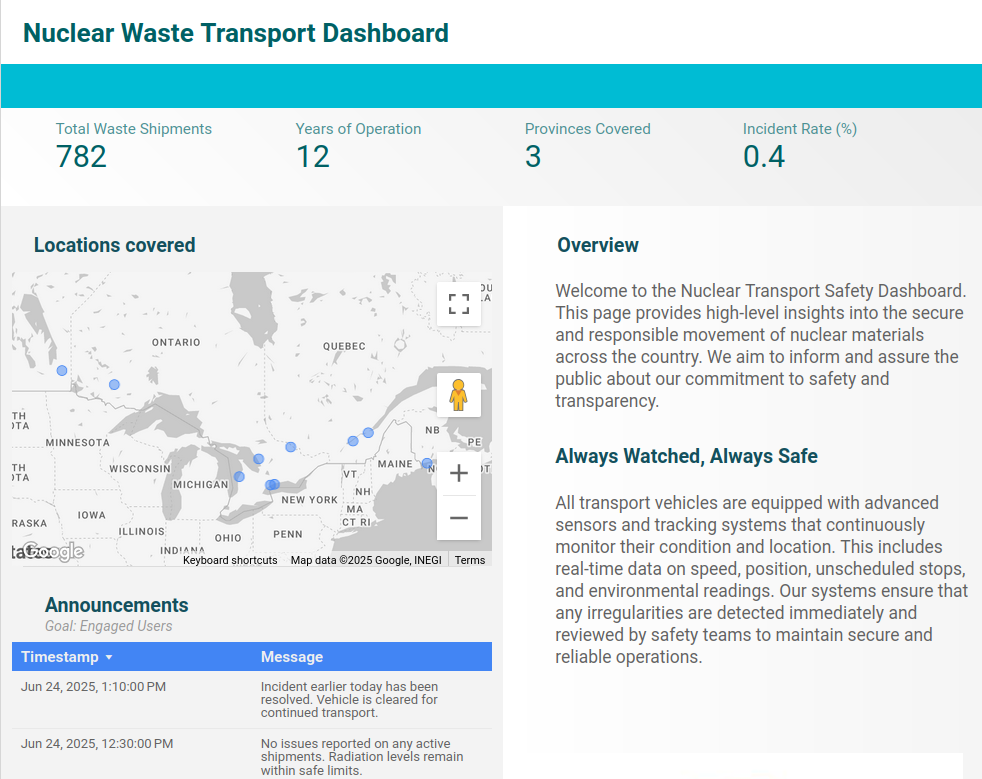

# ⚠️ Alerts and Communication Subproblem 

## For me: todos

* Update main front page README

* Final sections for this README:
    * Social media bot code section 
    * FAQ
    * Images

* user testing

* judging form

## Problem Description 
 Though CNL has developed the security systems to ensure safe and effective transport of the nuclear waste, they can never be truly failsafe. In the case of an incident, alerts must be rapidly disseminated to contain the hazards and minimize casualties. 

Your task is to design such a **communication system**, with information separately tailored for the **public** and the **authorities**.

This subproblem highlights the importance of responsible communication in critical infrastructure. The public should be informed, but not exposed to sensitive operational details. At the same time, internal teams must have access to detailed, real-time data for decision-making and emergency response.

### Potential Solutions 
* Two communication dashboards, one for the public and one for the authorities, that contain real-time updates on the truck's general location, status, and other relevant information.  
* A social media bot that posts alerts in the event of transport incidents  
* A mobile app that sends alert notifications in the event of transport incidents, which will only be displayed to people whose location is close to the incident 

<br>
🛠️ Here are the blueprints for a two-part solution: Looker Studio dashboards (which can can split between public and internal communications) and a Bluesky alert bot.

## Resources and links
* [**Link to Google Sheets dataset**](https://docs.google.com/spreadsheets/d/1OjUgnxIO0DFm4mhyJQ-2K-jQ2L1gPBy0DVwrID45a6Y/edit?usp=sharing): Make a copy to adjust and add new data to your liking. 
* [**CSV datasets**](Datasets): Datasets in CSV form to edit with other methods. 

### Dashboard 
* [**Link to example dashboard**](https://lookerstudio.google.com/reporting/a84d67a1-7bff-4ee6-bcbf-a2a09847bf65): A basic public-facing dashboard example
* [**Looker Studio documentation**](https://cloud.google.com/looker/docs/studio/about-the-how-to-guide): Complete resource for learning Looker Studio


### Social Media bot
* [**Bluesky Developer's Documentation**](https://gemini.google/subscriptions/): 
* [**gspread Documentation**](https://gemini.google/subscriptions/):
* [**Github Action introduction tutorial**](https://gemini.google/subscriptions/):
## Solution Template

### 📊 Part 1: Public and Internal Dashboard

---


#### What is a Dashboard?
A Dashboard is a tool, usually a web-application or a dedicated software, that provides a real-time overview of data. With visualizations such as charts, highlighted numbers, tables, and other structured ways of presenting information, dashboards make data more accessible and actionable.

#### What is Google Looker Studio? 

Google Looker Studio is a free web-based data visualization tool by Google. It allows you to turn raw data — like from Google Sheets — into interactive dashboards and real-time charts, without needing to code. 

It’s perfect for building simulated alert dashboards, interactive maps, or public information panels as part of this challenge. 

#### Connect Google Sheets to Looker Studio
We've provided a link to the Google Sheets spreadsheets containing the starting data. You can make a copy of it and use it as a the data source for your dashboard. 

1. Visit [lookerstudio.google.com](https://lookerstudio.google.com)

2. Click **“Blank Report”** or **“+ Create”** > **"Report"**

3. Click **"Add data"** and choose **“Google Sheets”** as your data source

4. Select your spreadsheet and the correct tab (sheet)

5. Click **“Add to Report”**

The template provides data such as the speed and statuses of the transport trucks, key locations, and a log of past incidents. However, you may find that you want to add new data for the story you want to tell.  

To avoid the tedious task of manually adding rows and rows of fake data, you can use LLMs to generate them for you. [**Google Gemini**](https://gemini.google/subscriptions/) on a 1-month free trial is highly recommended as Gemini can manipulate and fill in cells directly in Google sheets. Just remember to cancel the trial after finishing your solution. 
#### Add basic widgets
Looker Studio gives you building blocks called widgets to create dashboards. You can use them however you'd like to present the data for your intended audience. 

| Widget type       | Use case                                                              |   |   |   |   |   |   |   |   |
|-------------------|-----------------------------------------------------------------------|---|---|---|---|---|---|---|---|
| Table             | Show all active alerts, historical logs, etc.                         |   |   |   |   |   |   |   |   |
| Bar chart         | Show alert counts by region, facility, or type                        |   |   |   |   |   |   |   |   |
| Time series       | Display alert trends over time                                        |   |   |   |   |   |   |   |   |
| Google Maps chart | Plot transport routes or incident locations using latitude/longitude  |   |   |   |   |   |   |   |   |
| Filter controls   | Let users filter by alert type, date, status, or location             |   |   |   |   |   |   |   |   |

As an example, to set up a line graph that displays truck speed over time, along with a filter to switch between the truck: 
1. In the toolbar, click **"Add chart"** > **"Line"** > **"Line chart"**

2. In the **"Line chart properties"** tab, set the **"Data source"** as the **standard_transport** sheet of your spreadsheet. 

3. For **"Dimension"**, set **Timestamp (Date Hour Minute)**.

4. For **"Metric"**, set **Speed (km/h)**.

5. In the toolbar again, click **"Add a control"** and choose **"Drop-down list"**

6. After setting the Data source to **standard_transport** again, choose **Truck ID** For the **"Control Field"**

Now you can toggle between the two trucks using the filter to see their respective speeds over time on the line chart. 

For more advanced features of Looker Studio, read the [documentation](https://cloud.google.com/looker/docs/studio/about-the-how-to-guide) and most importantly, play around with it!

#### 💡 Suggested improvements 
* Add [conditional formatting](https://cloud.google.com/looker/docs/studio/use-conditional-formatting-rules-in-looker-studio) to differentiate between normal conditions and crisis conditions.  
    * For example, have the Radiation Level turn red when it reaches dangerous levels. 
* Add more filter options, such as Alert Type or Facility.  
* Add visual refinements, such as titles, icons, different fonts, and different colours. 
### 📣 Part 2: Bluesky Alert Bot    

---

#### What is an API?
An Application Programming Interface (API) serves as the connection between two or more software applications. It's now an ubiquitous part of software development, and its wide application includes connecting the interface of a website to its backend database, facilitating interactions between devices (e.g. smart lightbulb and a phone), and embedding content from another website onto your own. In this problem template, a Python script will access the Bluesky API to make automated alert posts. 

#### What is Bluesky? 
Bluesky is a decentralized social media platform that looks and functions similarly to X (formerly Twitter.) It was initially developed as a Twitter research initiative before becoming an indepedent company, and has rapidly grown in user count since Twitter's rebranding as X and subsequent executive changes. 

Most importantly, it's a relevant platform to deploy an alert bot because of its free API access. While Twitter has greatly reduced the posting and read limits on its API's Free tier, Bluesky's completely free-to-access API makes the bot easy to scale without cost limitations. 

#### Setting up Google Sheet API 
1.  Set up Google Cloud  

    i. Log into [Google Cloud](https://cloud.google.com/). Do this by following the link, scrolling down, and clicking **"Go to my console."**  

    ii. In the search bar, search and enable **Google Sheets API (Marketplace)**.  

    iii. In the left sidebar, navigate to **"APIs and Services"** > **"Credentials."**  

2. Create a service account  

    i. On the **"Credentials"** page, click **"Create Credentials"** > **"Service Account."**  

    ii. Name the service account and click **"Create and Continue."**  

    iii. Download the JSON key file for the service account. Rename it to `service_account.json`. Move it into the same folder as your Python script for now. 

3. Connect to Google Sheets  

    i. Open your Google Sheet containing all your data. 

    ii. Click the **"Share"** button and add the service account email address (`"client_email":`) found in your `service_account.json`.

    iii. Grant Editor permissions to the email. 

4. Connect your Python script  

    i. In your terminal, install the necessary libraries (replace atproto if you are not using Bluesky):
    ``` bash
     pip install gspread google-auth atproto
    ```  
    ii. Write the following code into your bot script:  
    ``` python
    import gspread
    from google.oauth2.service_account import Credentials

    # Define the scope
    scopes = [
        "https://www.googleapis.com/auth/spreadsheets",
        "https://www.googleapis.com/auth/drive"
    ]

    # Authenticate Google Sheets with credentials
    creds = Credentials.from_service_account_file("service_account.json", scopes=scopes)
    gc = gspread.authorize(creds)

    # Open the Google Sheet
    sheet = gc.open('Your_Google_Sheet').sheet1
    ```
    Now you can refer to specific columns, tables, rows, and more from your Google Sheets. Read more about how to use gspread [here](https://docs.gspread.org/en/latest/). 

#### Setting up social media connection
1. Start by reading and understanding the developer's documentation for your social media platform of choice. The documentation for Bluesky is available [here](https://docs.bsky.app/).

2. Set up a new account and save the username and password in a ``credentials.json`` file. Move that file into a ``secrets`` subfolder. It's good practice to not write the API credentials directly in your script and instead access it from somewhere else. 
    ``` json
    {
    "BLUESKY_USERNAME": "username",
    "BLUESKY_PASSWORD": "password"
    }
    ```

3. Import the json decoder module in the header of your Python script. 
    ``` python 
    import json
    ```

4. Write this snippet into your script to decode ``credentials.json`` and use the username and password in your script.
    ``` python
    # Load in credentials from credentials.json
    with open("secrets/credentials.json", "r") as f: 
        creds = json.load(f)

    username = creds["BLUESKY_USERNAME"]
    password = creds["BLUESKY_PASSWORD"]
    ```

5. Now you can use your credentials to access your platform's API. For accessing Bluesky with atproto:
    ``` python
    # Authorize Bluesky connection
    client = Client()
    client.login(username, password)
    ```
#### Write your code 


Try running the code. You should see it publish a new post on your feed. 

#### Automate via Github Action
We are going to use Github Action for a no-cost way of deploying the "bot". Github Action is a powerful tool that can automate creating new packages, deploying apps, listening for events and conditionally performing actions based on them, and more. [Here's](https://www.youtube.com/watch_popup?v=mFFXuXjVgkU) a great introduction video, but today we are simply using it to run the bot's script every 15 minute. 

1. Go to the Github repository of your project. Go to **"Settings"** > **"Security"** > **"Secrets and variables"** > **Actions**.  

2. In the **"Actions secrets and variables,"** tab, click **"New repository secret"** and paste the content of your ``service_account.json`` inside. Rename the secret to GOOGLE_CREDENTIALS and save.  

3. Now you can delete ``service_account.json`` from your repository.  

4. Go back to your repository and create a ``.github`` folder.  

5. Create another ``workflows`` subfolder inside. 

6. Create a new YAML (.yml) file that will contain the content of your automation script. We have provided a starting script that will simply run the bot script every 15 minute. 
    ``` yaml
    # This workflow is used for the Communication Subproblem. 
    # It automates the bot so that its script is run every 15 minute. 
    name: Bot Feed Updates

    # Controls when workflow will run 
    on: 
    # Allows running this workflow manually from the Actions tab of repo
    workflow_dispatch:
    # Run is scheduled every 15 min
    schedule:
        - cron: "*/15 * * * *"

    # A workflow run is made up of one or more JOBS
    jobs: 
    # This workflow contains a single job called "feed-update"
    feed-update: 
    # The runner that the job will run on
        runs-on: ubuntu-latest 

        # Steps represent a sequence of tasks that will be executed 
        # as part of the job
        steps:
        # Checks-out your repository under $GITHUB_WORKSPACE, 
        # so your job can access it
        - name: Checkout Repository 
            uses: actions/checkout@v4

        # Set up Python 
        - name: Set up Python
            uses: actions/setup-python@v5
            with: 
                python-version: '3.11'

        # Install Python dependencies 
        # Here, it first installs and updates pip
        # Then finds the requirements.txt file and installs the dependencies listed
        - name: Install Dependencies 
            run: |
            python -m pip install --upgrade pip 
            if [ -f requirements.txt ]; then pip install -r requirements.txt; fi

        # Create the service_accounts.json file that stores Google API credentials 
        # It's in the repository's secrets and not in the public repo, so it will be written to the repo now
        - name: Write service account JSON
            run: |
                cat <<EOF > service_accounts.json
                ${{ secrets.GOOGLE_CREDENTIALS }}
                EOF
                
        # Run the bot's script 
        - name: Run Bot Script 
            run: |
            python "Communication Subproblem/app_template.py"
            echo "Bot feed refreshed"
    ```
    YAML is a very easy language to learn, so you are encouraged to play around with the script and add additional logic.  

7. Test that the script work by going to the **Actions** tab of your repository and manually running the Workflow. 

Now your bot should be automated to run every 15 minute. If you want to stop it from continuously posting, you can disable the workflow until you need to present it. 

You are free to deploy the bot in other ways, such as by using any of the popular cloud infrastructure providers. Options that include generous free trials/always-free plans are [Google Cloud](https://cloud.google.com/free) and [Oracle Cloud Infrastructure](https://www.oracle.com/cloud/free/).

#### 💡 Suggested improvements 
* More specific alert types (may have to create new types of data in your dataset.)
* Instead of fixed scheduling at every 15 minute, have the bot only post in response to important updates
* Alerts in French for incidents in Quebec. 
* Better, more secure handling of API credentials.  
* Interactivity (e.g. reply to the bot to get more detailed information.)  
* Better organization of posts (e.g. instead of sending out individual posts, consolidate some into threads)

## FAQs


## Citations

https://medium.com/@thibautdonis1998/automating-your-workflows-on-a-schedule-github-actions-cron-fd7e662083c6  

https://docs.bsky.app/docs/get-started  

https://spreadsheetpoint.com/connect-python-and-google-sheets-15-minute-guide/

