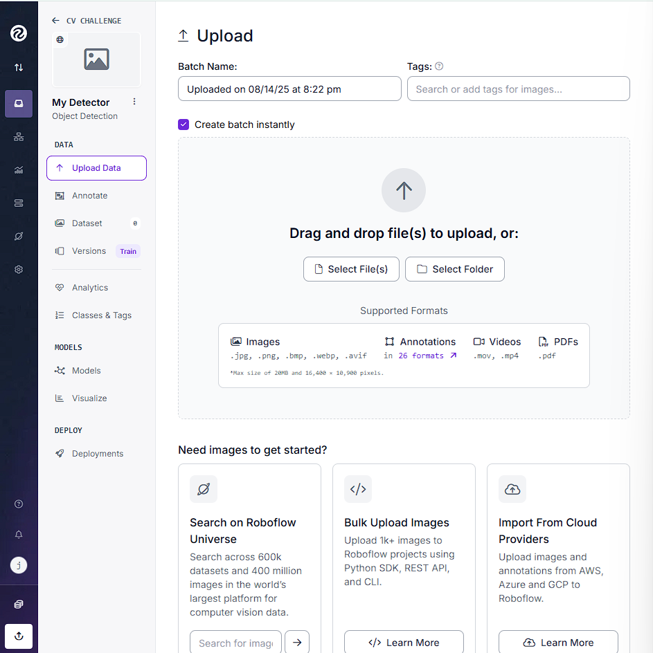
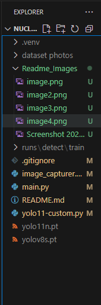

# 🚛 Nuclear Loading & Unloading Monitoring Challenge
Welcome aboard! 

At Canadian National Laboratories (CNL), spent nuclear fuel is loaded into nuclear flasks and then transported from the nuclear power plant where it is generated, to a new nuclear waste repository in Northern Ontario located in Ingrace. Even with strict oversight, accidents can still occur. A critical moment during the transportation process is the loading and unloading of the nuclear flasks, which store the unused nuclear fuel. The challenge presented is making this process safe and more secure. If not handled carefully, exposed nuclear fuel can cause serious health issues to those working with it, and due to its unique qualities, it may be subject to theft. Ensuring that only the correct number of authorised personnel is working with the fuel at a time, as well as ensuring that the nuclear flask is in good condition, is imperative to transporting nuclear waste. More information on this sub-problem can be found [here.](https://uofwaterloo.sharepoint.com/:w:/r/sites/tm-eng-engineeringideasclinic/_layouts/15/Doc.aspx?sourcedoc=%7B64B1861D-5FC8-454E-A262-28F26CA1BE14%7D&file=New%20Case%20Study.docx&action=default&mobileredirect=true)

 **your challange:** Design a system to enable a safer nuclear transfer process between vehicles that minimizes the possibility of material tampering and unauthorized intrusion to the transfer site.  

 **Minimum Requirement for Solution:**
 
 - Determine if there are unauthorized personnel, or if there are too many people in the loading/unloading area.  

 - Check the status of the nuclear flask to see if there is a spill, or mechanical failure. 

 - Check to see if the flask is secured to the truck.  

 

---------------------------------------------------------------------

## Reference Material


Ultralytics Yolo: https://docs.ultralytics.com/

Roboflow : https://universe.roboflow.com/

How to interpret performance metrics of computer vision model: https://docs.ultralytics.com/guides/yolo-performance-metrics/

Alternate Training Methods (Google Collab / Local Linux) :  https://www.youtube.com/watch?v=etjkjZoG2F0&t=769s

----------------------------------------------------------------------
## OPEN CV TUTUORIAL :
----------------------------------------------------------------------

## Project Setup

**Python Interfacing for CV:**

Note: It is strongly recommended to complete the computer vision challenge with a device that has a dedicated GPU.  
Challenge can run with cpu-only devices, but training and execution speed can be much slower.

**YOLO + OpenCV Environment Setup**

1. Pick an IDE, Microsoft Visual Studio is used for this tutorial, but IDEs like PyCharm could also work  
2. Create a new project/Clone this Repository  
3. Download Python 3.12.x (x can be any number) from: https://www.python.org/downloads/windows/  
4. Verify Python is installed: Open a new PowerShell after installation and type:  
   `py --list`  
   Python 3.12 should be listed like below:


---

**Virtual Environment Setup:**

1. From inside your IDE project, open a terminal window  
2. type: `cd [insert absolute path to your project locally]`  
3. type: `py -3.12 -m venv .venv`  
4. you should now see a folder called .venv in your project  


6. type: `.\.venv\Scripts\activate` to activate your virtual environment, your prompt head should become like this below:  


---

**Upgrade pip & Install YOLO:**

1. in the same terminal, type: `python -m pip install --upgrade pip`  
   - if there’s an output asking to download pip, follow instructions on that output  
2. Visit Pytorch: https://pytorch.org/get-started/locally/  

   IF your machine has a dedicated Nvidia GPU:  
   - type: `nvidia--smi` and read your CUDA version. This should be the first line of output  

3. On Pytorch website, select the following settings.


4. Change the CUDA version to whatever displayed on your nvidia-smi output. If your CUDA version has no exact match, choose the closest. (Ex: 12.6 can be chosen for CUDA version 12.5)  

   IF your machine has no GPU: select CPU  
5. Copy the command output and input it into your IDE's terminal  
6. type: `pip install ultralytics opencv-python` to install openCV  

---

To verify your setup: Run main.py to check for any errors. Please do not hesitate to reach out to the support team for any setup trouble.

----
## How to Train Your Model

Ultralytics YOLO is demonstrated at this setup document here. You are welcome to use any other vision models as see fit.

Terminology: 

Class - types of objects that will be detected in the vision model (Eg.Trees, Flowers, Cat)

Datasets - The set of data that bases the system output on

   Training Set- images used to fit the model and clarify distinguished elements between classes (largest split)

   Valid - Images used during training to tune/early-stop

   Test -  Images held out to measure final performance

Label - tTlls the model in the dataset what object is what 

Epoch - The round of trainning. The more rounds you run, the more accurate your model can be based on the provided images of the data set

Imgz - the size of the photos (L X W) in pixels

Batch - The number of photos processed before updating the weights of common characteristics 

workers - The number of threads dedicated to trainning the data


### Collect Training Datasets
You can choose to collect your own training images, or download training sets from Roboflow. Skip to download annotated dataset if you are using pre-annotated dataset

**Collect & mark your own dataset:**
1. Connect your webcam to your device
2. Run image_capturer and capture image contanining your target objects

Tips to collect good dataset： 

- Include background clutter and partial occlusions.

- Vary angles, distances, lighting.

- Keep labels balanced—avoid 95% of one class and 5% of another.


3. Visit Roboflow https://app.roboflow.com and create a project
4. Create a project, choose "Object Detection" as type. Clicking yes should take you to this page: 

5. Upload all your collected images using the "Upload Data" section
6. Navigate to "Classes & Tags" and input the classes you intent to track
7. Go to Annotate → Label Myself → Start Annotating.
8. For any objects that exists in the image, use the crossbow to draw a tight bounding box over it and select what class it belongs to. Continue until all images are labeled.

9. After, click back out and back to the Annotate section. Click on each of the Annotating sets, select "Add to dataset"
10. in Method, select “Split Images Between Train/Valid?test" and then click Add

**Download annotated dataset**

For own dataset: 
1. Models - train model - custom training
2. Add in prepocessing and augmentation steps (Feel free to play around with them). Click continue until this page

3. Click Download and select YOLOv11 as annotation format
4. download zip to computer -> continue

For existing datasets: 
Find the download button and follow the same steps above

--------------------------------------------------------------------------
## Training
A custome model can be trained by using the yolo11-custom.py file

1. unzip the dataset file downloaded in the last step
2. there should be a file in the zip called `data.yaml`
3. paste the path to your `data.yaml` file into the marked field in the file
Note: the r in front of the path is NOT a typo, it is needed for path to be recognized
4. Adjust training parameters. Details are written inside the script
5. Run the script.It may take a moment for the training to be set up and started. If you see the following outputs in terminal, you are proceeding as expected.


6. training has started if you see the following terminal output:


Tips: 
1. Consider adjusting your parameters if each epoch is taking longer than 5 minutes to complete
2. training can be paused by ctrl + c 
-----------------------------------------------------------------------------------

## Model Evaluation
After your training is finished running, your code's structure should look like this. Theres a Runs folder. 



If you have ran multiple trainings (incomplete ones count!), there will be folders called train, train1, train2, etc.. Click in the train folder that you would like to use. There should be several evaluation graphs given as below: 


Several evaluations are given including: 
- confusion matrix
   - Rows = actual classes in your dataset

   - Columns = what the model predicted

   - Numbers = how many times that combination happened

- results.png
- box curves

Deep dive into performance metrics can be found at: https://docs.ultralytics.com/guides/yolo-performance-metrics/

--------------------------------------------------------------------------------------------------------

## Model Deployment
The following code snippets can be used to deploy your trained model with live video feed. Just point your webcam to the scene and start monitoring: 


```python
import cv2
from ultralytics import YOLO
import math

# Load the model
yolo = YOLO("runs/detect/train3/weights/best.pt")# Paste in path to your trained model if you have one
#if not, yolo11n.pt is fine

# Load the video capture
videoCap = cv2.VideoCapture(0)  

while True:
    ret, frame = videoCap.read()
    if not ret:
        continue
    results = yolo.track(frame, stream=True)


    for result in results:
        # get the classes names
        classes_names = result.names

        # iterate over each box
        for box in result.boxes:
            # check if confidence is greater than 40 percent
            if box.conf[0] > 0.4:
                # get coordinates
                [x1, y1, x2, y2] = box.xyxy[0]
                # convert to int
                x1, y1, x2, y2 = int(x1), int(y1), int(x2), int(y2)

                # get the class
                cls = int(box.cls[0])

                # get the class name
                class_name = classes_names[cls]

                # get the respective colour
                colour = (0, 255, 0)

                # draw the rectangle
                cv2.rectangle(frame, (x1, y1), (x2, y2), colour, 2)

                    # put the class name and confidence on the image
                cv2.putText(frame, f'{classes_names[int(box.cls[0])]} {box.conf[0]:.2f}', (x1, y1), cv2.FONT_HERSHEY_SIMPLEX, 1, colour, 2)
                
    # show the image
    cv2.imshow('frame', frame)


    # break the loop if 'q' is pressed
    if cv2.waitKey(1) & 0xFF == ord('q'):
        break

# release the video capture and destroy all windows
videoCap.release()
cv2.destroyAllWindows()
```
In Main.py, there are several functions that can be used to pick out specific objects detected in frame. Your own functions can also be written as well like the ones shown below. 

''' python 
#return class id for a given class name
def get_target_id(result, target_class_name):
    target_id = None
    for class_id, class_name in result.names.items():
        if class_name == target_class_name:
            target_id = class_id
            break
    return target_id

#find centre of a detected object box
def box_center(box):
    x1, y1, x2, y2 = map(int, box.xyxy[0])
    cx = (x1 + x2) // 2
    cy = (y1 + y2) // 2
    return cx, cy

#allows you to pick out a certain zone in the video livestream using percentage of FOV
#(0,0) of a frame is at the top left
# (0,0) ───────────────►  X increases →
#   │
#   │
#   ▼ Y increases
def zone_select(x1,x2,y1,y2,frame):#input zone area as percentage of total FOV
     h, w = frame.shape[:2]
     return (int(x1*w), int(y1*h), int(x2*w), int(y2*h))
    
    

#function definition to detect specific classes counted in FOV
def detection_count(result, target_class_name):
    target_id = None
    for class_id, class_name in result.names.items():
        if class_name == target_class_name:
            target_id = class_id
            break

    if target_id is None:
        return 0
    
    count = 0
    for box in result.boxes:
        if int(box.cls[0]) == target_id:
            count +=1

    return count

#functions counting number of specific class objects in a specific zone

def location_detect(result, target_class_name, zone_rect):
    target_id = get_target_id(result, target_class_name)
    if target_id is None:
        return 0
    count = 0
    for box in result.boxes:
        cls_id = int(box.cls[0])
        if cls_id != target_id:
            continue

        cx, cy = box_center(box)
        x1,y1,x2,y2 = zone_rect
        if cx > x1 and cx < x2 and cy > y1 and cy < y2:
            count += 1

    return count

#function that returns a boolean if a nuclear flask is moving
#nuclear flask must be recognized as an image class first
#assume there can be only 1 nuclear flask in frame at a time
def is_moving(result, target_class_name, dist_thresh_px):
    global prev_flask_centre
    target_id = get_target_id(result, target_class_name)

    #case: no flask right now, no flask from before
    if target_id is None and prev_flask_centre is None: 
        return False

    for box in result.boxes:
        if int(box.cls[0]) == target_id:
            cx,cy = box_center(box)

        #case: object just appeared
        if prev_flask_centre == None:
            prev_flask_centre = (cx,cy)
            return False
        #case: object appeared before and is still in frame
        dist = math.hypot(cx - prev_flask_centre[0], cy - prev_flask_centre[1])
        prev_flask_centre = (cx, cy)
        return dist > dist_thresh_px
        
    #case: object is in last frame but now disappered
    prev_flask_centre = None
    return False
    '''


   


   
   


